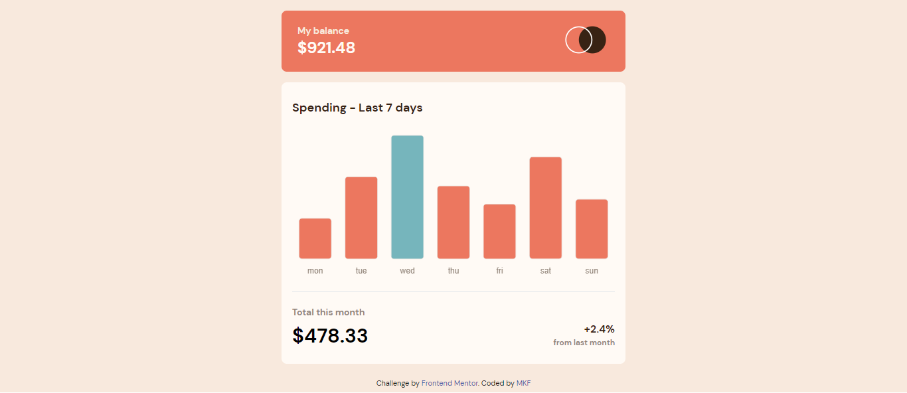

# Frontend Mentor - Expenses chart component solution

This is a solution to the [Expenses chart component challenge on Frontend Mentor](https://www.frontendmentor.io/challenges/expenses-chart-component-e7yJBUdjwt). Frontend Mentor challenges help you improve your coding skills by building realistic projects.

## Table of contents

- [Overview](#overview)
  - [The challenge](#the-challenge)
  - [Screenshot](#screenshot)
  - [Links](#links)
- [My process](#my-process)
  - [Built with](#built-with)
  - [What I learned](#what-i-learned)
  - [Useful resources](#useful-resources)
- [Author](#author)

## Overview

### The challenge

Users should be able to:

- View the bar chart and hover over the individual bars to see the correct amounts for each day
- See the current day’s bar highlighted in a different colour to the other bars
- View the optimal layout for the content depending on their device’s screen size
- See hover states for all interactive elements on the page
- **Bonus**: Use the JSON data file provided to dynamically size the bars on the chart

### Screenshot

### Links

- Solution URL: [ https://www.frontendmentor.io/solutions/expenses-chart-component-using-tailwindcss-and-chartjs-f9awsSIGXS ]
- Live Site URL: [ https://expensess-chart-component-solution.netlify.app]

## My process

### Built with

- Semantic HTML5 markup
- CSS custom properties
- Flexbox
- Mobile-first workflow
- [Tailwindcss](https://https://tailwindcss.com/) - CSS Framework
- [Chartjs](https://www.chartjs.org/)

### What I learned

- Chart Js

### Useful resources

- [Chart js tutorial Youtube Channel](https://www.youtube.com/@ChartJS-tutorials) - This helped me for customization of chartjs

## Author

- Mohammed Fakih
- Frontend Mentor - [@javascriptor1](https://www.frontendmentor.io/profile/javascriptor1)
- Twitter - [@javascriptor1](https://www.twitter.com/javascriptor1)
